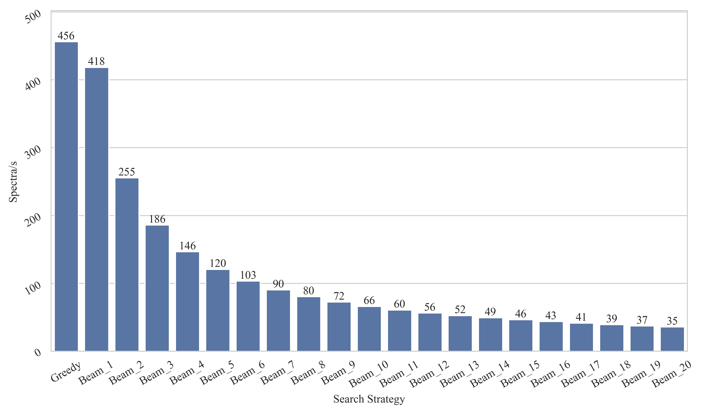
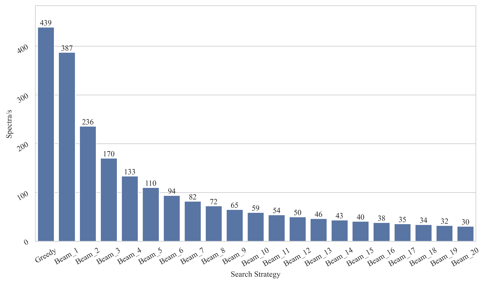

# Benchmarks

## Inference Speed

All inference experiments were conducted on a single NVIDIA RTX 4090 GPU.

The nine Species V1 dataset is the full-scale dataset, not the subsampled 10k `.mgf` subset.

The Nine Species V2 dataset is identical to the dataset used in the Casanovo V2 paper. However, we filtered out a subset of the data that exhibited excessively large deviations between the observed precursor ion m/z and the theoretical m/z calculated from the sequence annotations. Detailed data counts for each species post-filtering can be found in the appendix of our paper.

### Average Throughput (Spectra/s)

*The figure below illustrates the average speed across different search strategies (Greedy Search vs. Beam Search).*

#### Nine Species V1

#### Nine Species V2

### Speed per Species

*A detailed breakdown of the inference speed across the nine individual species.*

#### Nine Species V1

#### Nine Species V2

## Metrics

Isoleucine (I) and Leucine (L) are not distinguished and are treated as equivalent.

In mass spectrometry *de novo* sequencing, standard evaluation metrics include Amino Acid Precision, Amino Acid Recall, and Peptide Recall (which is equivalent to Peptide Precision). These are typically defined by requiring both the single-step residue mass difference and the cumulative mass difference to be within 0.1 Da and 0.5 Da.

However, cases exist where the masses are similar but the actual residues differ, such as `D` vs. `N+0.984` and `E` vs. `Q+0.984`. Therefore, we introduced strict character-level metrics alongside the traditional mass-based ones. A prediction is only considered fully successful if the predicted sequence exactly matches the ground truth at the character level.

Here, we only present the results with a beam size of 10. For more comprehensive results, please refer to [06_metric_calculation.ipynb](../tutorials/06_metric_calculation.ipynb).

### Nine Species V1

#### Realistic Data Augmentation

| Species      | AA Precision | AA Recall | Peptide Recall | Full Accuracy |
| :----------- | :----------: | :-------: | :------------: | :-----------: |
| Bacillus     |    0.867     |   0.866   |     0.715      |     0.688     |
| Clambacteria |    0.740     |   0.733   |     0.522      |     0.503     |
| Honeybee     |    0.810     |   0.810   |     0.617      |     0.609     |
| Human        |    0.815     |   0.814   |     0.657      |     0.653     |
| Mmazei       |    0.827     |   0.827   |     0.647      |     0.620     |
| Mouse        |    0.847     |   0.843   |     0.639      |     0.627     |
| Ricebean     |    0.864     |   0.851   |     0.715      |     0.694     |
| Tomato       |    0.836     |   0.831   |     0.687      |     0.667     |
| Yeast        |    0.814     |   0.809   |     0.677      |     0.663     |
| **Mean**     |  **0.824**   | **0.820** |   **0.653**    |   **0.636**   |

#### Dummy Data Augmentation

| Species      | AA Precision | AA Recall | Peptide Recall | Full Accuracy |
| :----------- | :----------: | :-------: | :------------: | :-----------: |
| Bacillus     |    0.870     |   0.869   |     0.716      |     0.689     |
| Clambacteria |    0.740     |   0.734   |     0.519      |     0.500     |
| Honeybee     |    0.813     |   0.813   |     0.619      |     0.609     |
| Human        |    0.817     |   0.815   |     0.659      |     0.654     |
| Mmazei       |    0.828     |   0.828   |     0.650      |     0.623     |
| Mouse        |    0.846     |   0.842   |     0.635      |     0.624     |
| Ricebean     |    0.861     |   0.850   |     0.712      |     0.690     |
| Tomato       |    0.836     |   0.831   |     0.686      |     0.667     |
| Yeast        |    0.818     |   0.814   |     0.682      |     0.668     |
| **Mean**     |  **0.825**   | **0.822** |   **0.653**    |   **0.636**   |

### Nine Species V2

#### Realistic Data Augmentation

| Species      | AA Precision | AA Recall | Peptide Recall | Full Accuracy |
| :----------- | :----------: | :-------: | :------------: | :-----------: |
| Bacillus     |    0.940     |   0.938   |     0.857      |     0.829     |
| Clambacteria |    0.849     |   0.846   |     0.630      |     0.609     |
| Honeybee     |    0.905     |   0.904   |     0.773      |     0.763     |
| Human        |    0.953     |   0.953   |     0.872      |     0.868     |
| Mmazei       |    0.938     |   0.937   |     0.835      |     0.796     |
| Mouse        |    0.899     |   0.896   |     0.707      |     0.699     |
| Ricebean     |    0.948     |   0.947   |     0.858      |     0.824     |
| Tomato       |    0.930     |   0.928   |     0.827      |     0.805     |
| Yeast        |    0.950     |   0.950   |     0.886      |     0.869     |
| **Mean**     |  **0.924**   | **0.922** |   **0.805**    |   **0.785**   |

#### Dummy Data Augmentation

| Species      | AA Precision | AA Recall | Peptide Recall | Full Accuracy |
| :----------- | :----------: | :-------: | :------------: | :-----------: |
| Bacillus     |    0.939     |   0.938   |     0.856      |     0.828     |
| Clambacteria |    0.849     |   0.845   |     0.630      |     0.606     |
| Honeybee     |    0.907     |   0.906   |     0.775      |     0.763     |
| Human        |    0.953     |   0.952   |     0.872      |     0.868     |
| Mmazei       |    0.938     |   0.937   |     0.835      |     0.798     |
| Mouse        |    0.897     |   0.894   |     0.703      |     0.695     |
| Ricebean     |    0.948     |   0.947   |     0.858      |     0.823     |
| Tomato       |    0.930     |   0.928   |     0.827      |     0.804     |
| Yeast        |    0.951     |   0.951   |     0.888      |     0.875     |
| **Mean**     |  **0.924**   | **0.922** |   **0.805**    |   **0.784**   |

### Nine Species CV

#### Small Range

| species      | AA Precision | AA Recall    | Peptide Recall | Full Accuracy |
| :----------- | :----------- | :----------- | :------------- | :------------ |
| bacillus     | 0.847700     | 0.847496     | 0.680776       | 0.656299      |
| clambacteria | 0.687136     | 0.684363     | 0.472057       | 0.454827      |
| honeybee     | 0.756459     | 0.758343     | 0.554997       | 0.549030      |
| human        | 0.671279     | 0.675525     | 0.463988       | 0.452027      |
| mmazei       | 0.804227     | 0.804831     | 0.615487       | 0.593373      |
| mouse        | 0.796726     | 0.794701     | 0.550363       | 0.535048      |
| ricebean     | 0.845133     | 0.843411     | 0.717485       | 0.701443      |
| tomato       | 0.802746     | 0.801924     | 0.642986       | 0.625209      |
| yeast        | 0.794270     | 0.795623     | 0.650253       | 0.638287      |
| **Mean**     | **0.778409** | **0.778469** | **0.594266**   | **0.578394**  |

### NovoBench

This dataset consists of three subsets: HC PT, Nine Species, and Seven Species. Each subset is already pre-split into training, validation, and test sets. We have additionally included PTM Precision, PTM Recall, and a peptide-level AUC metric for comprehensive evaluation.

Please note that during data processing, we found discrepancies in the HC PT dataset where the precursor ion m/z does not match the theoretical m/z calculated from the annotated peptide. We thank the authors of RefineNovo for bringing this to our attention. However, since other baseline methods were trained on this **unfiltered data**, we still used it for training and testing in the results below to ensure a fair comparison.

Furthermore, we observed that using a large batch size on this dataset under the current settings leads to poor convergence. We suspect this might be caused by the data quality issues. (While this might be mitigated through careful hyperparameter tuning, we plan to add an Optuna-based hyperparameter search script for small datasets to our tutorials in the future). The results reported below were obtained by training the model on two NVIDIA RTX 4090 GPUs with a per-GPU batch size of 32. Please refer to the specific configuration files for complete training details.

**Correction Note:** Additionally, a clarification regarding the PTM metrics: Since all `C` residues were uniformly replaced with `C+57.021`, our original manuscript mistakenly included this fixed modification in the PTM metric calculations for the HC PT dataset. The results presented below reflect the corrected metrics. The script for the updated calculation can be found at [06_metric_calculation.ipynb](../tutorials/06_metric_calculation.ipynb).

| Dataset / Species | AA Precision | AA Recall | Peptide Precision | Peptide Recall | PTM Precision | PTM Recall | Full Accuracy | Curve AUC |
| :---------------- | :----------: | :-------: | :---------------: | :------------: | :-----------: | :--------: | :-----------: | :-------: |
| **HC PT**         |    0.670     |   0.670   |       0.513       |     0.513      |     0.743     |   0.780    |     0.512     |   0.472   |
| **Nine Species**  |    0.832     |   0.833   |       0.665       |     0.665      |     0.835     |   0.765    |     0.654     |   0.633   |
| **Seven Species** |    0.568     |   0.571   |       0.368       |     0.368      |     0.544     |   0.514    |     0.357     |   0.310   |

> Full Accuracy denotes the strict character-level sequence matching accuracy.